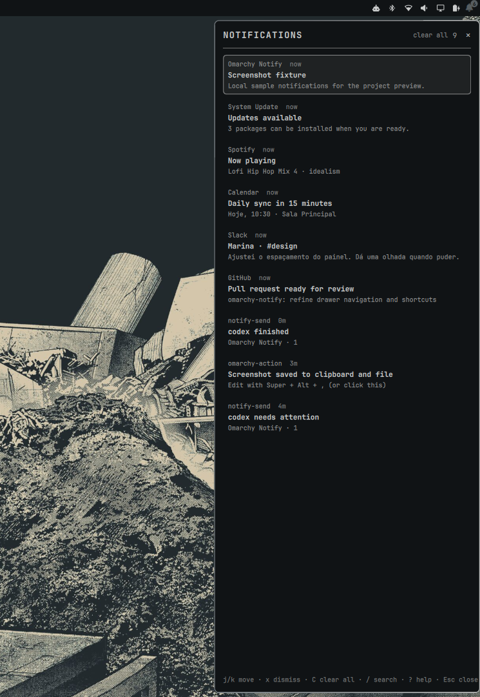

# Omarchy Notify

[Leia em português](README.pt-BR.md)



Omarchy Notify is a keyboard-first notification center for Omarchy Quattro, with mouse support if you want it. Only if you really want it.

Suggested global hotkey: `SUPER + ALT + N`.

## How it works

The drawer is anchored to the right edge of the screen and slides left into view. The desktop remains visible beside it: this is a shell surface, not a centered modal.

Close it with `Esc`, the `×` button, the bell again, or a click anywhere outside the drawer.

Omarchy remains the notification daemon. Omarchy 4.0.3 does not expose notification entries to ordinary third-party widgets, so Omarchy Notify reads the local snapshots that the built-in daemon already writes and keeps a private archive. It does not replace the daemon or modify Omarchy's notification state.

## Features

- Right-edge drawer with outside-click dismissal.
- Bar bell with an unread badge.
- One chronological list, search mode, keyboard selection, item dismissal, and `clear all`.
- Search only appears after `/` and does not steal normal typing shortcuts.
- Plain-text notification bodies and local images only.
- No telemetry, networking, downloads, or arbitrary commands from notification content.

## Requirements

- Omarchy with Quattro plugin support and Quickshell 0.3 or newer.
- `jq`, `file`, and `inotifywait` from `inotify-tools`.

## Install

Install from the repository URL:

```sh
omarchy plugin add https://github.com/LadiesMan0217/omarchy-notify.git --enable
```

To install this checkout:

```sh
cd /path/to/omarchy-notify
omarchy plugin validate .
omarchy plugin add "$(pwd)" --enable
```

The plugin ID is `caio.omarchy-notify`; its default bar section is `right`.

## Uninstall

```sh
omarchy plugin remove caio.omarchy-notify
```

## Usage

- Click the bell or use the global hotkey to toggle the drawer.
- Click outside the drawer or press `Esc` to close it.
- Click a notification to select it.

| Key | Action |
| --- | --- |
| `j` / `↓` | Next notification |
| `k` / `↑` | Previous notification |
| `g` / `G` | First / last notification |
| `x` / `d` | Dismiss selected notification |
| `Shift+C` | Clear all archived notifications |
| `/` | Open and focus search mode |
| `Esc` | Leave search mode, then close the drawer |
| `?` | Show shortcut help |

## IPC and global hotkey

```sh
omarchy-shell shell toggle caio.omarchy-notify '{}'
omarchy-shell shell summon caio.omarchy-notify '{}'
omarchy-shell shell hide caio.omarchy-notify
```

The Omarchy plugin manifest has no keybinding or post-install hook. Installation therefore does not edit Hyprland configuration. To opt in to a global shortcut, add this to `~/.config/hypr/bindings.lua`:

```lua
o.bind("SUPER + ALT + N", "Omarchy Notify", "omarchy-shell shell toggle caio.omarchy-notify '{}'")
```

Then reload Hyprland:

```sh
hyprctl reload
```

Before choosing another shortcut, check conflicts with:

```sh
omarchy menu keybindings --print
```

## Update and removal

```sh
omarchy plugin update caio.omarchy-notify
omarchy plugin remove caio.omarchy-notify
```

## Development and validation

```sh
omarchy plugin validate .
/usr/lib/qt6/bin/qmllint -I "$OMARCHY_PATH/shell" BarWidget.qml Panel.qml Service.qml
omarchy-shell shell rescanPlugins
notify-send "Omarchy Notify" "Test notification"
```

## Architecture

```text
BarWidget.qml              bell, unread badge, IPC, drawer host
Panel.qml                  drawer UI, keyboard input, search, clear all
Service.qml                archive-reader lifecycle and QML state
NotificationLogic.js       filtering, sanitization, relative time
bin/omarchy-notify-store   local archive and inotify watcher
```

## Limitations

- Clicking a notification only selects it. The inspected third-party API does not expose default actions or application launch data, so this plugin does not replay them.
- DND is not exposed to ordinary third-party widgets on the inspected Omarchy 4.0.3 API.
- `clear all` and dismissal only affect Omarchy Notify's private archive; they never delete or dismiss notifications owned by Omarchy itself.

## License

[MIT](LICENSE).
